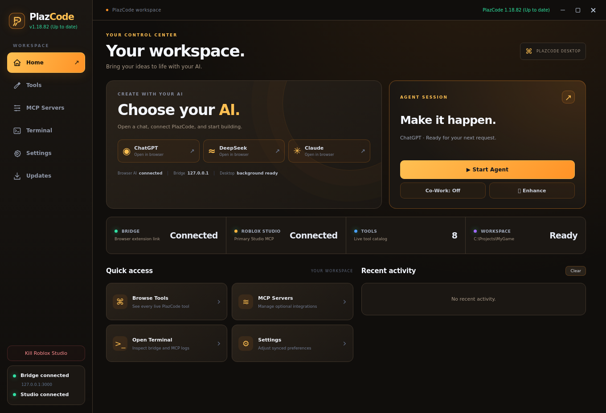

# PlazCode updates

This repository hosts the official PlazCode update packages and the automatic update feed.

## Install once

Download `PlazCode-1.18.84.zip`. On an existing 1.18.77 installation, run `Update-PlazCode.bat` and select that ZIP. For a new installation, extract it and run `PlazCode.exe`, then load its browser extension.

## Future updates

Version indicators in 1.18.81 check the published release at startup and every five minutes. They show green **Up to date**, red **Outdated**, or a neutral unavailable/not-checked status.

In the desktop app, open **Updates**, click **Check now**, then **Update now**. Download progress is shown, installation verifies the package, and PlazCode relaunches.

Run `Update-PlazCode.bat`. It checks `latest.json`, downloads a newer published ZIP, verifies SHA256, installs it, and restarts PlazCode. Reload the extension in `chrome://extensions` and refresh open AI chat tabs afterwards.

Memory, settings and cached optional runtimes are preserved. A custom non-empty release-feed URL takes precedence over the default repository.

## Publish an update

Upload a complete `PlazCode-VERSION.zip` with a `PlazCode/` top-level folder and update `latest.json` in the same commit. Its fields are `version`, `url` (the ZIP's raw HTTPS download URL), `sha256` (the ZIP's complete SHA256 hash), and `release_notes` (release titles, summaries, additions, improvements and fixes). Use a higher package/extension version and a new filename for every release. Do not modify published ZIP bytes in place.

The BAT can only install releases that have been published here. Source changes or chat attachments alone do not publish an update.

See `UPDATE.txt` and `UPDATER.txt` inside the ZIP for change details and recovery information. Windows updater execution still requires live validation.

## Desktop preview

Browser-rendered desktop preview using sample connection data:

## Release history

### PlazCode 1.18.84: Clickable palettes & friendly readiness

Select desktop themes directly from their color swatches, and keep Notion startup acknowledgements readable.

#### New additions

- Desktop startup instructions accept up to 25,000 characters, with an input counter and explicit save validation.

#### Improvements

- All six desktop color swatches are clickable, keyboard accessible, show the selected theme and use the same saved appearance settings as the dropdown. Glow and gradient preferences are preserved.
- Chat export retains messages captured while scrolling during the current page session. Idle Notion exports briefly load older history and restore the previous scroll position. Exports report their captured message count and remaining scope limitations.
- Download export is styled as a theme-colored button in desktop and browser memory settings.

#### Bug fixes

- All startup instruction variants explicitly request “PlazCode is ready.” instead of a generic readiness sentence.
- If Notion still returns the legacy PLAZCODE_READY token from earlier chat context, its visible acknowledgement is normalized to “PlazCode is ready.” without resending startup or modifying Notion-owned DOM.
- DeepSeek rich-text composers remain discoverable while input-locked, and agent writes temporarily enable editing then restore the lock. Explicit Send labels take precedence over stop-icon guesses.

### PlazCode 1.18.83: Clearer update indicators

Outdated version badges now explicitly say that a new update is available.

#### Improvements

- Desktop, browser bar and popup version badges show “(Outdated - New update available)” when a newer published version is detected. Red highlighting and existing current/unavailable states are preserved.

### PlazCode 1.18.82: Desktop overhaul & smoother Notion sessions

A redesigned desktop workspace, complete color themes and a polished animated updater, with focused Notion and Co-Work improvements.

#### New additions

- A distinct desktop layout: compact navigation, a dedicated agent-session card, AI launch cards, a slim connection strip, and redesigned Tools, MCP, Settings, Terminal and Updates surfaces.
- Animated SVG update swirl with layered rotating arcs, a pulsing center and a redesigned progress dialog. Reduced-motion preferences are respected.
- Expandable Working/Worked summaries in the chat show elapsed time and tool activity; completed details collapse automatically and reopen on click.

#### Improvements

- Themes now color panels, navigation, borders, inputs, buttons, connection surfaces, terminal and update dialogs as well as accents.
- Startup asks the AI to say “PlazCode is ready.”; older readiness acknowledgements remain accepted.
- Co-Work follow-up text uses the website composer’s text color, font, size and alignment. Only the placeholder is grey. Existing queue behavior is preserved.
- Copilot and Meta AI removed from supported-site choices, routing and extension injection.

#### Bug fixes

- Notion can settle a stable readiness acknowledgement without waiting through its nine-second generation tail; live Stop or workflow progress still blocks completion.
- Notion pastes an escaped literal HTML representation alongside plain text so rich-text Markdown conversion does not consume command/result markers. Complete-draft retention and send-confirmation checks remain in place.
- Notion reserves space inside the composer for the PlazCode bar, keeping response text and the native editor clear without modifying React-owned attributes.

### PlazCode 1.18.81: Themes, release notes & desktop refresh

See what each PlazCode update adds, improves and fixes before installing it.

#### New additions

- Release descriptions on the desktop Updates page, including expandable notes for earlier releases.
- The GitHub README now lists release titles, summaries, additions, improvements and fixes.
- An updated maintenance prompt documents architecture, current features, debugging, tests, builds and release publishing.
- Appearance settings with Orange, Amethyst, Polar Cyan, Rose, Emerald and Graphite palettes, glow strength, gradient controls and a default-theme reset. Selections apply immediately and are remembered on this device.
- Version indicators in the desktop, browser bar/menu and extension popup show green “Up to date”, red “Outdated”, or a neutral unavailable/not-checked status. Release checks run at startup and every five minutes.

#### Improvements

- Published update metadata carries the same release notes used in the README.
- Installed release notes remain available before checking online.
- Home places agent controls beside the AI shortcuts on wide windows, reducing unused space; smaller windows stack them neatly.
- The installed-to-latest version arrow is larger, vertically aligned with the version values and spaced more closely.
- Visual-only desktop polish: smoother navigation, card depth, hover and press feedback, keyboard focus, toggles and modal backgrounds. Existing actions and workflows stay the same.
- Quick Actions no longer stretches to match a tall Recent Activity panel; activity stays scrollable.
- A denser desktop layout reduces empty space in status cards and quick actions, with refreshed typography, surfaces and subtle orange highlights.

### PlazCode 1.18.80: Updates, memory transfer & AI shortcuts

Update PlazCode from the desktop app and carry chat context between supported AI sites.

#### New additions

- Desktop Updates tab with installed/latest versions, Check now, Update now, download progress and relaunch.
- ChatGPT, DeepSeek and Claude shortcuts below Home’s connection displays.
- Current-chat memory export and a memory-only export option.

#### Improvements

- Transparent Enhance and Co-Work controls; labels now read Co-Work: Off and Co-Work: On.
- Styled desktop memory import file picker.
- Saved AI memories retain conversation origins after edits, including facts learned in more than one chat.

#### Bug fixes

- Memory-only imports now include saved facts in the destination AI’s context.
- Oversized combined history and memory are rejected before saving or sending.
- View on GitHub opens in the default browser instead of navigating the embedded app.

### PlazCode 1.18.78: Automatic update setup

A stable repository feed lets the update BAT fetch published packages.

#### New additions

- Configured HTTPS update feed hosted in stoveez/PlazCodeneww.

#### Improvements

- Version and SHA256 checks, staged installation, backups and local settings preservation.

#### Bug fixes

- Blank feed settings from 1.18.77 now fall back to the configured repository.

### PlazCode 1.18.77: Shared memory & activity

PlazCode can remember lasting preferences across chats and transfer loaded conversation context.

#### New additions

- Shared personal memory with automatic saving controls and an editable summary.
- Chat history and memory import/export.
- Working/Worked indicators with expandable activity.
- Studio status below the desktop bridge indicator.
- Update-PlazCode.bat with a local ZIP fallback.

#### Improvements

- Saved memory is available across supported provider chats.
- Completed tool activity collapses while final replies remain visible.

